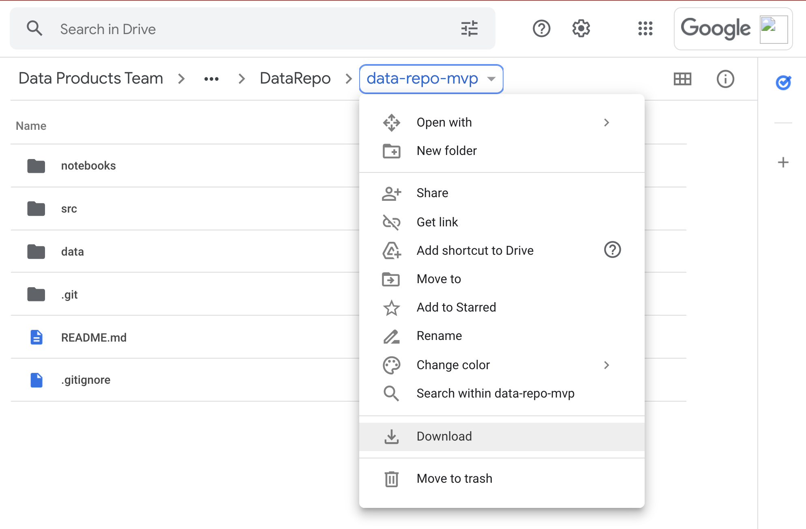
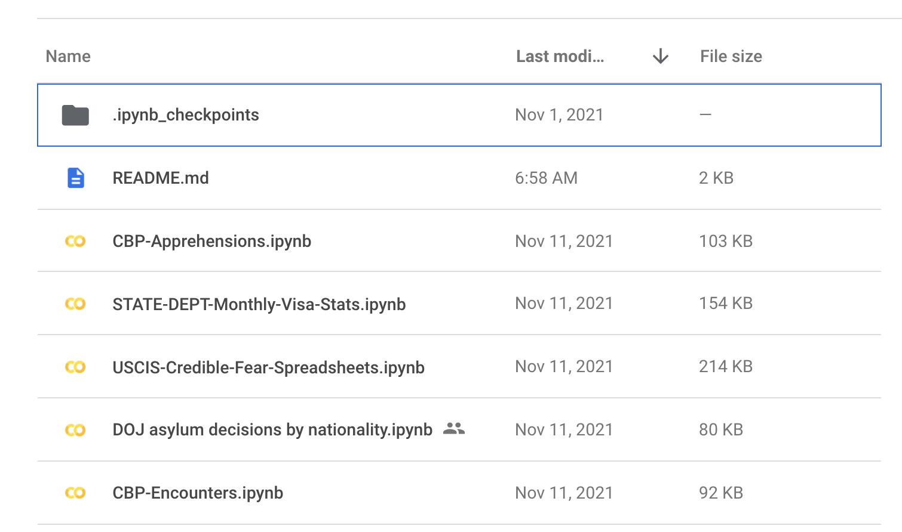
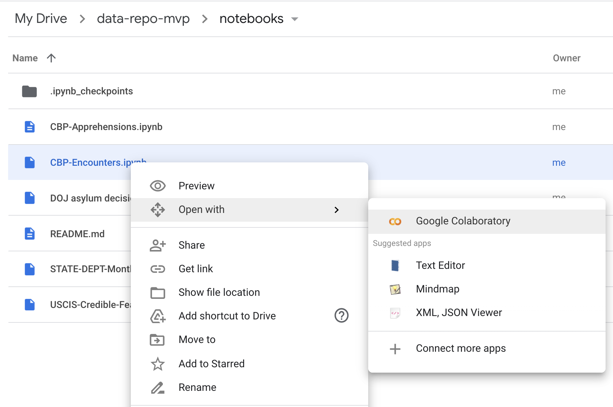
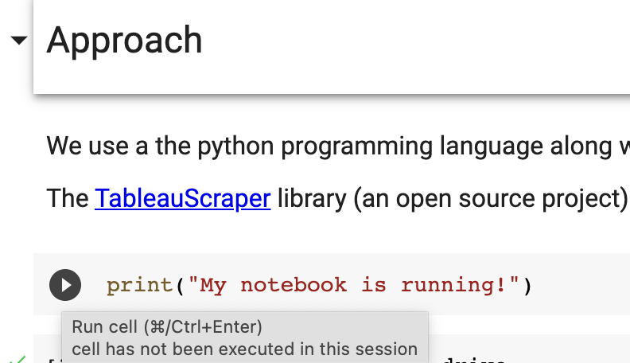
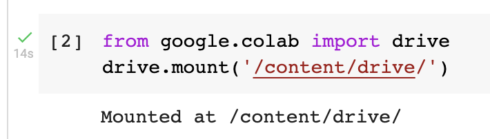
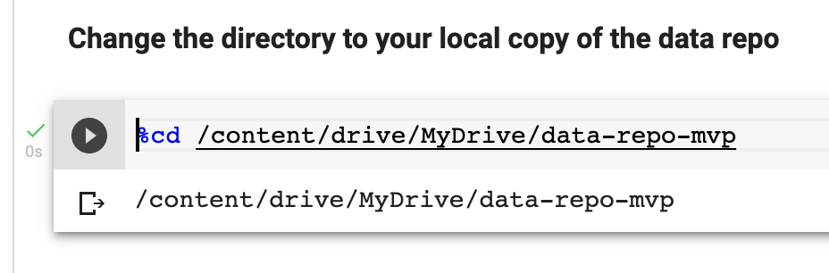

# The Immigration Data Repository 

## Background 
The Immigration Data Hub (the Data Repo) is ................
* Share code to scrape specific sample of datasets from
* Provide those data samples from
* Highlight how code can be applied to other datasets to allow subject matter experts to obtain the data they need to do their work with
* One can access the downloaded files directly by seeing 


## Getting Started 

### 1. Are you just looking for the data?
 
 See the [Data Inventory](#data-inventory) table. The links in the **See Data** column will connect you to where the extracted data for that specific source is located. 
 * We update the data every 
 <span style="color:red">**!! TBD-TODO !!**</span> 
 * Data outputs may be in the form of a single file or multiple files depending on the source. 

 We recommend reviewing the code notebooks used to generate the data to allow for better understanding of how to extract such information and what the data structure will be. 

<br>

### 2. Would you like to review and run the code used to generate data? 

Fantastic ! We have used code notebooks (called Jupyter Notebooks) to write Python code to extract the different datasets. 


#### **If you are new to Python and Jupyter Notebooks** else [go here](#if-you-are-a-coder-and-comfortable-with-python) <br>
This code can be run in a number of different ways but we recommend utilizing google colab notebooks initially to review and run this code. 


Note: Please keep this browser window open on the side to follow these directions and see additional contextual information regarding the structure of the repo and information on the datasets and code included.

* Step 1 - Get Repo in Gdrive: 
    * Download this google [folder](https://drive.google.com/drive/folders/1lw3NcE8jEQxgZISVknKUSpJKcFc-6Ruq?usp=sharing) as a zip, this may take 5-10 minutes. 
    * Unzip the downloaded folder and then place it in a Google Drive folder you have full access to.
* Step 2 - Notebooks: 
    * Now that the folder is in Google Drive, you can use the Google Colab tool. Colab is a cloud based coding environment where you can run Python code in the browser using Google's cloud computers. 
    * Open the **notebooks** folder  to see the notebooks currently available in this repo. 
* Step 3 - Open Notebook in Colab: 
    * Now we will open a notebook in Colab. Right click on the **CBP-Encounters.ipynb** and select <br>`Open with >> Google Colaboratory`. 
   
* Step 4 - The colab notebook 
    * Now that the colab notebook has opened you have a working python code environment running right from your browser. This is much easier than managing a full python installation. A notebook is a collection of "cells" or areas that you can use to execute code. Each cell is a single block of code, or other information (such as headings, text information, etc.). To run a cell you can just click the small play button to the far left of any cell.

        

    * You can either click each play button in sequence, or you can use the keyboard shortcut of SHIFT + ENTER to execute them as well. 
* Step 5 
    * The last step before you can fully run the code in the notebook is to mount your Google Drive into the colab environment. When you open a `.ipynb` file in colab it opens it in the Colab Notebooks section of your drive and does not automatically mount the rest of your information. Since we need to be able to save files to the drive (like downloading pdfs) and then open them to do processing we must mount the drive. You can do this by executing the following cell

        

    * This should launch a window here you can authorize colab to access your google drive, or create a link where you authorize the drive and then paste an authorization code into an area below the cell. 
    *  Once authorized you should be able to see you drive files in the file explorer to the left of the screen by clicking on the small folder icon. Click on MyDrive (or any other name it might be), then navigate to where you saved the `data-repo-mvp` folder, right click and select **Copy path** to that folder. 

        

    * Last step: Paste that path after the `%cd ` in the cell marked **Change the directory to your local copy of the data repo** and then run that cell (press play button to the left).

        

    * Then If you were successful you should see that path printed below the cell, if you see anything else such as 
    
        ```[Errno 2] No such file or directory:``` 

        Then perhaps you need to restart the notebook and start over. You can do this by clicking **Runtime** from the top drop down menus, and then **Restart Runtime**. Then just start executing the cells from the top and reauthorize etc if needed. 

Step 6 - Running through the notebooks:
     
* Hooray ! You've made it thought the set up and now you can start using code to work with this data. The various notebooks present in these repo provide a wide variety of functionality for:

    * Downloading PDF files
    * Extracting data from embedded Tableau dashboards on a website and
    * Parsing structured data from PDFs
    * Pulling tables directly from Websites
    * Processing data out of many individual excel files 
    * and more ... 

We suggest running through notebooks of interest cell by cell. Its ok if you don't understand all of it but at least review the steps that are occurring. Also reference the [Notebooks Readme file](./Notebooks/README.md) and look at the **output data files**. In addition we have saved interim raw files in the [./Data/raw_source_files/](./Data/raw_source_files/) directory. 

<br>

#### **If you are a coder and comfortable with Python**<br>
Then we suggest just cloning this repository and visiting the [notebooks folder](notebooks). The documentation in the notebooks folder should provide all information needed. Note it is assumed you have the standard python scientific computing libraries already installed. Other uncommon libraries that are used are `pip install`'d within the notebooks.  

----------------------------------------------

## Tools Used
* Python 3
* Google [Colab Notebooks](https://colab.research.google.com/notebooks/intro.ipynb) / [Jupyter Notebooks](https://jupyter-notebook-beginner-guide.readthedocs.io/en/latest/what_is_jupyter.html)

## Repository Structure 
```
data-repo-mvp
 ┣ data: Holds raw and processed data used in notebooks. 
 ┃ ┣ extracted_data: Processed or semi-processed data generated from notebooks. 
 ┃ ┗ raw_source_files: Raw files downloaded from sources, for instance PDF files. 
 ┣ notebooks: Jupyter/Colab notebooks used to extract/scrape/download data. 
 ┣ src: Folder to hold generic code used in the notebooks for specific data tasks. 
 ┗ README.md
## Repository Structure 
```


## Data Inventory 

| Dataset Name      | Source | Updated Regularly? | Original URL      | See Data | Status| 
| ----------- | ----------- | --- | ----------- | ----------- | -- | 
| Encounters      | CBP       | Yes | [source](https://www.cbp.gov/newsroom/stats/southwest-land-border-encounters)      | Title       | (status) |
| Visa Issuances   | USCIS        | Yes | [source](https://travel.state.gov/content/travel/en/legal/visa-law0/visa-statistics.html)      | Title       | (status) |
| (name)   | US Census        | No? | Header      | Title       | (status) |
| (name)   | US Census        | No? | Header      | Title       | (status) |


**Running


## License 
    TBD 

--------------------------------

**Contact**: mdowd@emersoncollective.com, ada@emersoncollective.com, dat@emersoncollective.com

