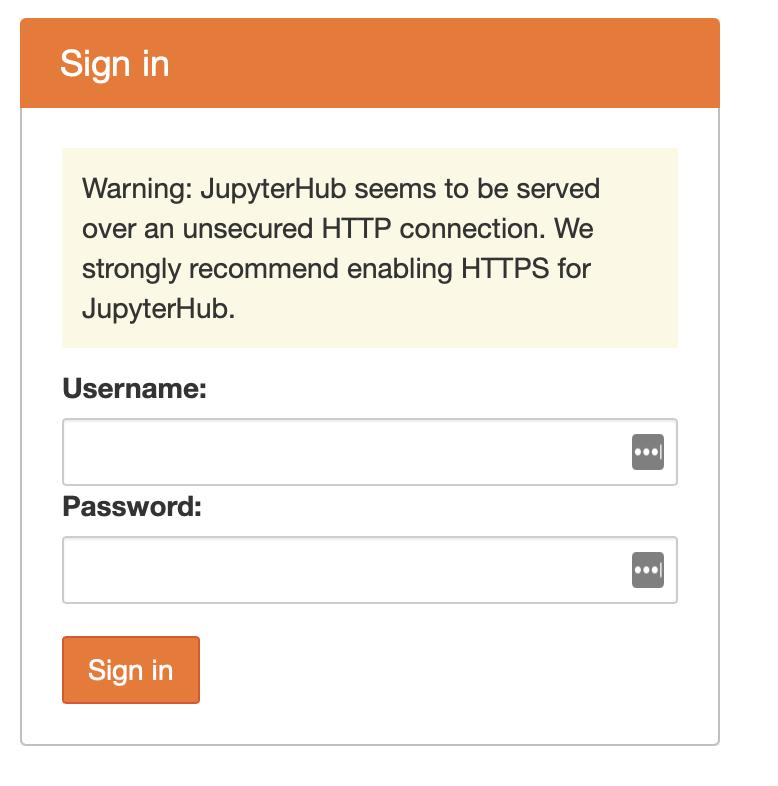
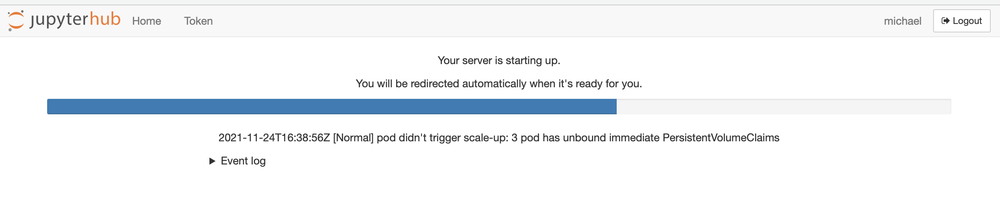
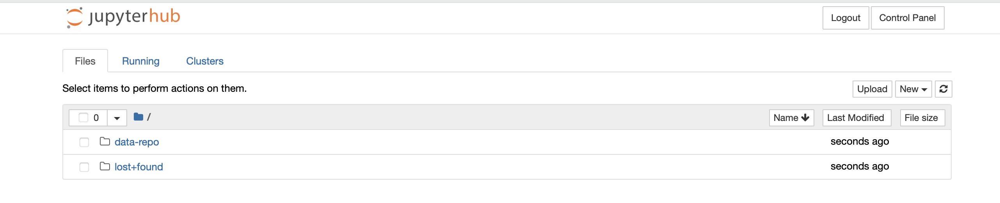

# The Immigration Data Repository 

## Background 
The Immigration Data Repo is powered by the Emerson Collective. This is a place where you can find immigration datasets that have been collected by various methods, mostly from public sources. 

We hope you can not only find datasets to use here, but to also...
* download the data
* get a sense of how the data was collected
* learn how to use, and adapt, code to procure and format datasets
* connect and engage with a community of trusted peers to learn from/with
* contribute any code and/or datasets you may wish to the community

Have any questions? Hit us up on the Data Repo's [Slack Channel]


## Getting Started 

### 1. Are you just looking for the data?
 
 See the [Data Inventory](#data-inventory) table. The links in the **See Data** column will connect you to where the extracted data for that specific source is located. 
 * We update select datasets as new data gets released 
 <span style="color:red">**!! TBD - not yet true but hopefully soon!!**</span> 
 * Data outputs may be in the form of a single file or multiple files depending on the source. 

 We recommend reviewing the code notebooks used to generate the data to allow for better understanding of how to extract such information and what the data structure will be. 

<br>

### 2. Would you like to review and run the code used to generate data? 

Fantastic ! We have used code notebooks (called Jupyter Notebooks) to write Python code to extract the different datasets. 


#### **If you are new to Python and Jupyter Notebooks** else [you can skip this section](#if-you-are-a-coder-and-comfortable-with-python) <br>
This code can be run in a number of different ways but we recommend using a custom coding environment we have setup for this project. You can begin by visiting [JupyterHub](http://104.198.52.81/). Login with the username and password we have provided. 

<br>



<br>

Once you have logged in an environment will be created that contains the code notebooks we have created. It may take a couple of minutes for the environment to start up. 
<br>



<br>

Eventually you will be presented with the following screen. 

<br>



<br>

There will be 2 folders, `data-repo` and `lost+found`, you can ignore the `lost+found` folder, but the `data-repo` folder contains the notebooks, data and code we are interested in. Inside `data-repo` there is a folder called `notebooks` please open up this folder. 
     
* Hooray ! You've made it and can now start using code to work with this data. All code is shared in Jupyter notebooks using the Python programming language. A notebook is a collection of "cells" or areas that you can use to execute code. Each cell is a single block of code, or other information (such as headings, text information, etc.).  The various notebooks present in these repo provide a wide variety of functionality for:

    * Downloading PDF files
    * Extracting data from embedded Tableau dashboards on a website and
    * Parsing structured data from PDFs
    * Pulling tables directly from Websites
    * Processing data out of many individual excel files 
    * and more ... 


 To run a cell you can just click the small play button to the far left of any cell.

<br>


<br>

You can either click each play button in sequence, or you can use the keyboard shortcut of SHIFT + ENTER to execute them as well.  We suggest running through notebooks of interest cell by cell. Its ok if you don't understand all of it but at least review the steps that are occurring. Also reference the [Notebooks Readme file](./Notebooks/README.md) and look at the **output data files**. In addition we have saved interim raw files in the [./Data/raw_source_files/](./Data/raw_source_files/) directory. 

We are excited for you to be able to work with these notebooks, see how conecpts and strategies within could be applied to your work more broadlly. We suggest working through those notebooks that are most relevant to you first. If you run into any issues or problems please don't hesitate to reach out on the [Slack Channel - TODO](link) or via email mdowd@emersoncollective.com, dat@emersoncollective.com.


<br>

#### **If you are a coder and comfortable with Python**<br>
Then we suggest just cloning this repository and visiting the [notebooks folder](notebooks). The documentation in the notebooks folder should provide all information needed. Note it is assumed you have the standard python scientific computing libraries already installed. Other uncommon libraries that are used are `pip install`'d within the notebooks.  

----------------------------------------------

## Tools Used
* Python 3
* Google [Colab Notebooks](https://colab.research.google.com/notebooks/intro.ipynb) / [Jupyter Notebooks](https://jupyter-notebook-beginner-guide.readthedocs.io/en/latest/what_is_jupyter.html)
* Java 8

## Repository Structure 
```
data-repo-mvp
 ┣ data: Holds raw and processed data used in notebooks. 
 ┃ ┣ extracted_data: Processed or semi-processed data generated from notebooks. 
 ┃ ┗ raw_source_files: Raw files downloaded from sources, for instance PDF files. 
 ┣ notebooks: Jupyter/Colab notebooks used to extract/scrape/download data. 
 ┣ src: Folder to hold generic code used in the notebooks for specific data tasks. 
 ┗ README.md
## Repository Structure 
```


## Data Inventory 

| Dataset Name      | Source | Updated Regularly? | Original URL      | See Data |See Code| Status |
| ----------- | ----------- | --- | ----------- | ----------- | -- | --|
| Encounters (until 2019)     | CBP       | Yes | [source](https://www.cbp.gov/newsroom/stats/southwest-land-border-encounters)      | [Dataset]()       |[Code]()       | (status) |
| Encounters (after 2019)     | CBP       | Yes | [source]()      | [Dataset]()       | (status) |
| Visa Issuances (monthly)   | USCIS        | Yes | [source](https://travel.state.gov/content/travel/en/legal/visa-law0/visa-statistics.html)      | [Dataset]()       |[code]()       | (status) |
| Asylum Decisions (by Nationality)   | DOJ        | No? | Header      | [Dataset]()       |[code]()       | (status) |
| Credible Fear   | USCIS       | No? | Header      | [Dataset]()       |[code]()       | (status) |


**Running


## License 
    TBD 

--------------------------------

**Contact**: mdowd@emersoncollective.com, ada@emersoncollective.com, dat@emersoncollective.com

