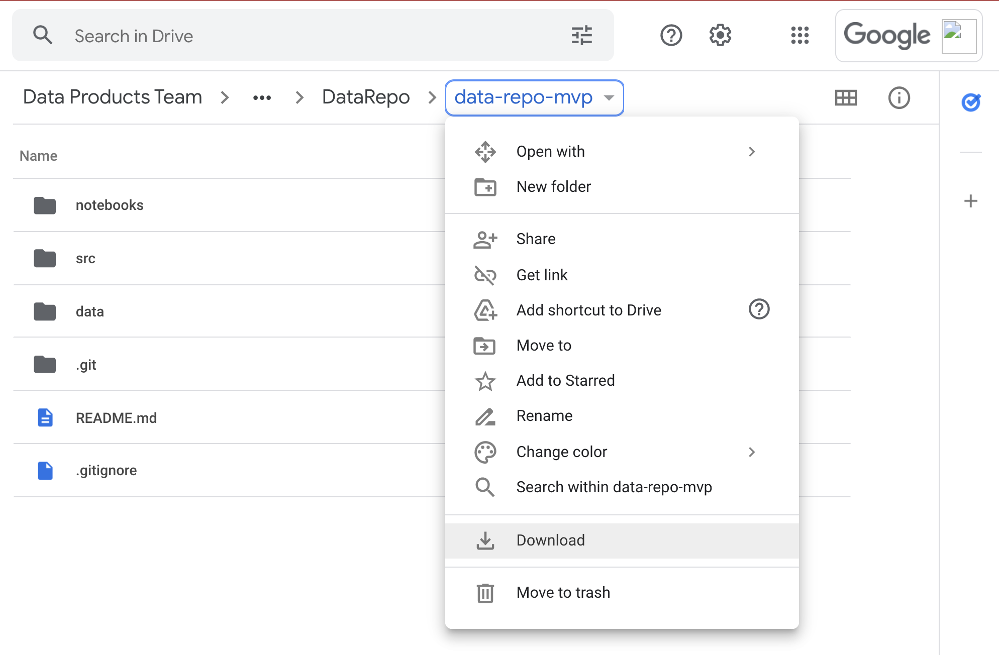
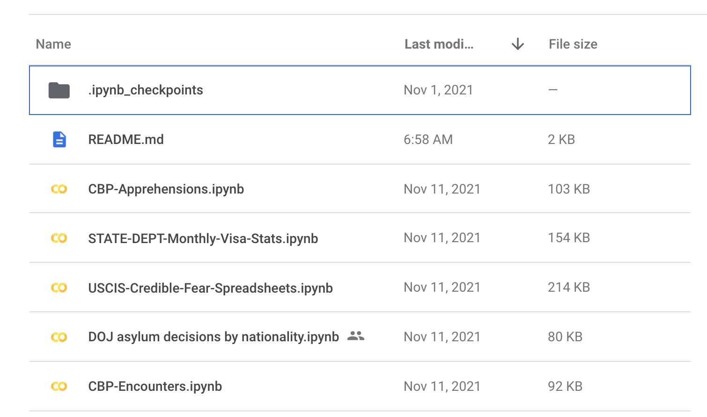
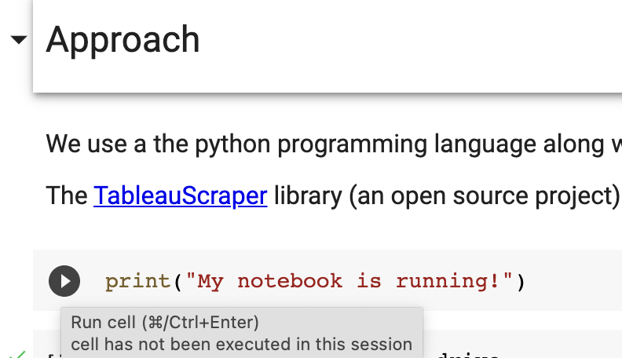

# Using Google Colab


Note: Please keep this browser window open on the side to follow these directions and see additional contextual information regarding the structure of the repo and information on the datasets and code included.

* Step 1 - Get Repo in Gdrive: 
    * Download this google [folder](https://drive.google.com/drive/folders/1lw3NcE8jEQxgZISVknKUSpJKcFc-6Ruq?usp=sharing) as a zip, this may take 5-10 minutes. 
    * Unzip the downloaded folder and then place it in a Google Drive folder you have full access to.
* Step 2 - Notebooks: 
    * Now that the folder is in Google Drive, you can use the Google Colab tool. Colab is a cloud based coding environment where you can run Python code in the browser using Google's cloud computers. 
    * Open the **notebooks** folder  to see the notebooks currently available in this repo. 
* Step 3 - Open Notebook in Colab: 
    * Now we will open a notebook in Colab. Right click on the **CBP-Encounters.ipynb** and select <br>`Open with >> Google Colaboratory`. 
   
* Step 4 - The colab notebook 
    * Now that the colab notebook has opened you have a working python code environment running right from your browser. This is  easier than managing a full python installation. A notebook is a collection of "cells" or areas that you can use to execute code. Each cell is a single block of code, or other information (such as headings, text information, etc.). To run a cell you can just click the small play button to the far left of any cell.

        

    * You can either click each play button in sequence, or you can use the keyboard shortcut of SHIFT + ENTER to execute them as well. 
* Step 5 
    * The last step before you can fully run the code in the notebook is to mount your Google Drive into the colab environment. When you open a `.ipynb` file in colab it opens it in the Colab Notebooks section of your drive and does not automatically mount the rest of your information. Since we need to be able to save files to the drive (like downloading pdfs) and then open them to do processing we must mount the drive. You can do this copying the following cell into your notebook:

    ```
    from google.colab import drive
    drive.mount("/content/drive/", force_remount=True)
    ```

    * When you run this cell it should launch a window where you can authorize colab to access your google drive, or create a link where you authorize the drive and then paste an authorization code into an area below the cell. 
    *  Once authorized you should be able to see you drive files in the file explorer to the left of the screen by clicking on the small folder icon. Click on MyDrive (or any other name it might be), then navigate to where you saved the `data-repo-mvp` folder, right click and select **Copy path** to that folder. 

        

    * Last step: Add a new cell after and copy the following code into it:
    ```
        %cd {Your copied path}
    ```
    Paste the copied path you have after the `%cd` then run the cell. This will change the directory and ensure that you are working inside the data repo folder. 

    * Then If you were successful you should see that path printed below the cell, if you see anything else such as 
    
        ```[Errno 2] No such file or directory:``` 

        Then perhaps you need to restart the notebook and start over. You can do this by clicking **Runtime** from the top drop down menus, and then **Restart Runtime**. Then just start executing the cells from the top and reauthorize etc if needed. 

Step 6 - Running through the notebooks:

Now that you are set up in Colab you can run through the notebooks using their environment. Refer back to the primary [README.md](README.md) file for more information. 

## Troubleshooting

* If you get a `ModuleNotFoundError` when trying to run the code in Colab, you can run `%pip install {module name}` and install it into the Colab environment. Please note that every time you start a new colab session you may need to rerun those install cells, so its a good idea to make a copy of the notebook and save it with those cells. 