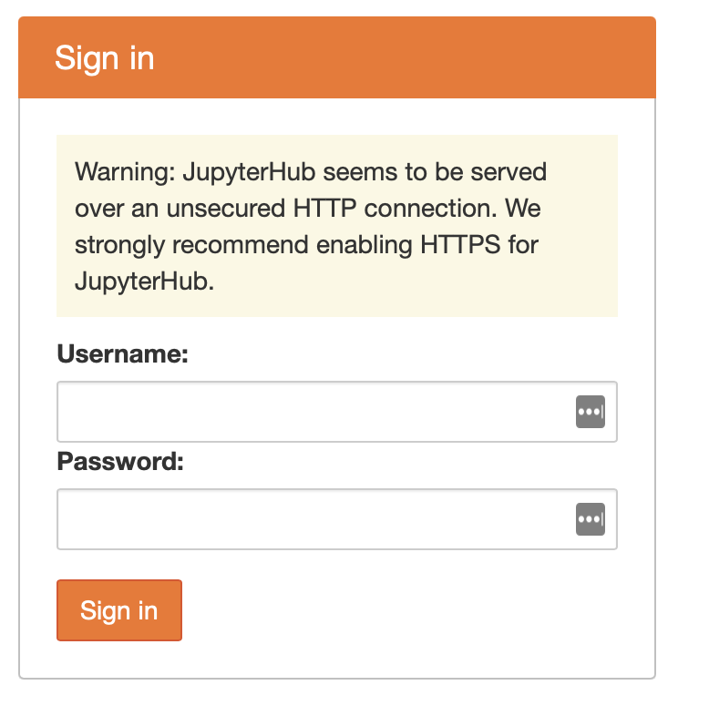

# So you know *enough* Python, and want to learn about Jupyter Notebooks.

This code can be run in a number of different ways. For those who are new(-ish) to Python, Jupyter Notebooks are containers that hold code, along with snapshots of outputs, and annotated text, allowing for readability and sharing.
* https://www.dataquest.io/blog/jupyter-notebook-tutorial/
* https://realpython.com/jupyter-notebook-introduction/

We have created a custom coding environment where you can run these notebooks. This will eliminate the need to manage a Python environment on your local computer. You can begin by visiting our [JupyterHub](TBD). Login with the username and password we have provided. 
 

 

Once you have logged in an environment will be started that contains the code notebooks we have created. It may take a couple of minutes for the environment to start up. 
 

 
 
Eventually you will be presented with the following screen. 
 
 

 
There will be 2 folders, `data-repo` and `lost+found`, you can ignore the `lost+found` folder, but the `data-repo` folder contains the notebooks, data and code we are interested in. Inside `data-repo` there is a folder called `notebooks` please open up this folder. 
     
Hooray ! You've made it and can now start using code to work with immigration data. All code is shared in Jupyter notebooks using the Python programming language. A notebook is a collection of "cells" or areas that you can use to execute code. Each cell is a single block of code, or other information (such as headings, text information, etc.). 

 The various notebooks present in these repo provide a wide variety of functionality for:
    * Downloading PDF files
    * Extracting data from embedded Tableau dashboards on a website and
    * Parsing structured data from PDFs
    * Pulling tables directly from Websites
    * Processing data out of many individual excel files 
    * and more ... 

 To run a cell you can just click the small play button to the far left of any cell.
 

 

You can either click each play button or use the keyboard shortcut of SHIFT + ENTER to execute them as well.  We suggest running through notebooks of interest cell by cell. Its ok if you don't understand all of it but at least review the steps that are occurring. Also reference the [Notebooks Readme file](./Notebooks/README.md) and look at the **output data files**. In addition we have saved interim raw files in the [./Data/raw_source_files/](./Data/raw_source_files/) directory. 

We are excited for you to be able to work with these notebooks, see how the concepts and strategies within could be applied to your work more broadly. We suggest starting with those notebooks that are most relevant to you first. 

If you run into any issues or problems please don't hesitate to [let us know](#contactus).

 
