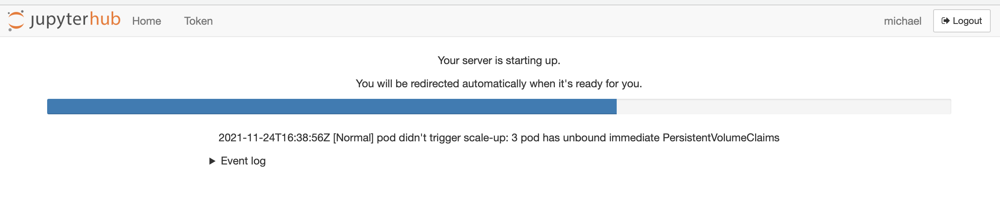
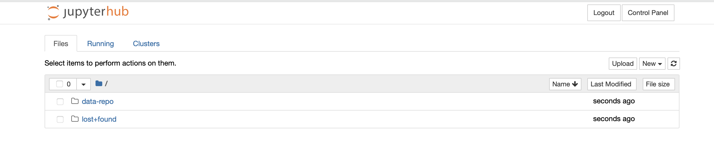

# So you know *enough* Python, and want to learn about Jupyter Notebooks.

The EC Data Repository takes advantage of Jupyter Notebooks and JupyerHub to make the code easier for users to read and run. For those who are new(-ish) to Python, Jupyter Notebooks are containers that hold code, along with snapshots of outputs, and annotated text, allowing for readability and sharing. JupyterHub is a hosted solution that gives users access to computational environments and resources without burdening the users with installation and maintenance tasks.

## Getting into the Data Repo's JupyterHub

We have created a custom coding environment where you can run these notebooks. This will eliminate the need to manage a Python environment on your local computer. You can begin by visiting our [JupyterHub](TBD). Login with your username and password. 
 

 

Once you have logged in an environment will be started that contains the code notebooks we have created. It may take a couple of minutes for the environment to start up. 
 

 
 
Eventually you will be presented with the following screen. 
 
 

 
There will be 2 folders, `data-repo` and `lost+found`, you can ignore the `lost+found` folder, but the `data-repo` folder contains the notebooks, data and code we are interested in. Inside `data-repo` there is a folder called `notebooks` please open up this folder. 
     
Hooray ! You've made it and can now start using code to work with immigration data. All code is shared in Jupyter notebooks using the Python programming language. A notebook is a collection of "cells" or areas that you can use to execute code. Each cell is a single block of code, or other information (such as headings, text information, etc.). 

## What can I do on my JupyterHub?

On your JupyterHub, you can access code that has been written by EC (written as executable Jupyter Notebooks) as well as their outputs. You, the user, have read-write privilege on your JupyterHub, and the view is for yourself only. This means that you are free to write your own code (or edit existing code), and to run it on the JupyterHub -- however it will not be shared with any other user asides from yourself.

Any notebooks or datasets that have been shared on your JupyerHub by EC will be maintained by EC. If there are any updates, we will zap them over to your JupyterHub! 

**RECOMMENDATION:**
We highly recommend you create your own folder for any code or Notebooks you would like to write.
Would you like to make edits to any code from EC? We recommend making a copy of that notebook and placing it in your folder...

## How do I run a Jupyer Notebook?

To run a cell you can just click the small play button to the far left of any cell.
 

 

You can either click each play button or use the keyboard shortcut of SHIFT + ENTER to execute them as well.  We suggest running through notebooks of interest cell by cell. Its ok if you don't understand all of it but at least review the steps that are occurring. Also reference the [Notebooks Readme file](./Notebooks/README.md) and look at the **output data files**. In addition we have saved interim raw files in the [./Data/raw_source_files/](./Data/raw_source_files/) directory. 

We are excited for you to be able to work with these notebooks, see how the concepts and strategies within could be applied to your work more broadly. We suggest starting with those notebooks that are most relevant to you first. 

**If you run into any issues or problems please don't hesitate to [let us know](#contactus).**

 

-----
## Additional Resources

## What is a Jupyter Notebook and a JupyterHub?
* [Dataquest - Jupyter Tutorial](https://www.dataquest.io/blog/jupyter-notebook-tutorial/)
* [realpython - Jupyter Notebook Introduction](https://realpython.com/jupyter-notebook-introduction/)
